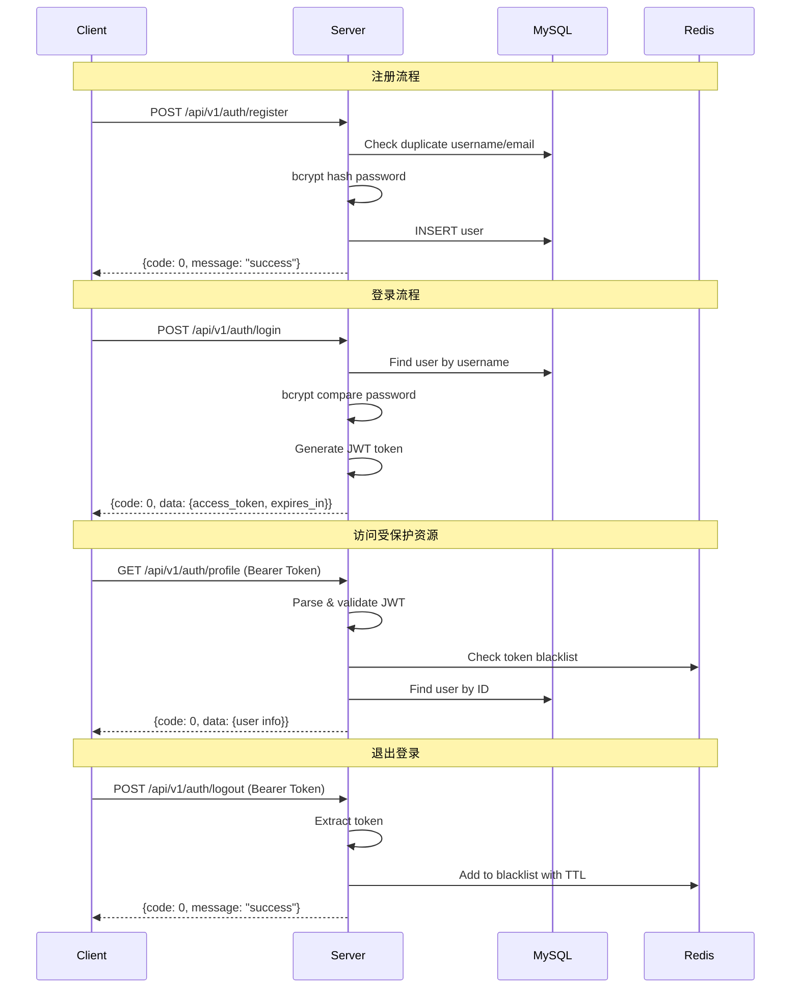

# JWT 认证流程

## 完整流程图

## 步骤说明

### 1. 用户注册
- 客户端提交用户名、邮箱、密码
- 服务端校验参数，检查用户名/邮箱唯一性
- 使用 bcrypt 对密码进行哈希处理（cost=10）
- 将用户信息存入 MySQL

### 2. 用户登录
- 客户端提交用户名和密码
- 服务端查找用户，使用 bcrypt 验证密码
- 生成 JWT Token（包含用户 ID、签发时间、过期时间）
- 返回 access_token 和过期时间

### 3. 访问受保护资源
- 客户端在请求头中携带 `Authorization: Bearer <token>`
- JWT 中间件解析并验证 Token
- 检查 Redis 中是否存在该 Token（黑名单）
- 验证通过，将用户 ID 注入 Context

### 4. 退出登录
- 客户端发送退出请求
- 服务端将当前 Token 加入 Redis 黑名单
- 设置 TTL 与 Token 剩余有效期一致
- 后续请求中该 Token 将被拒绝
